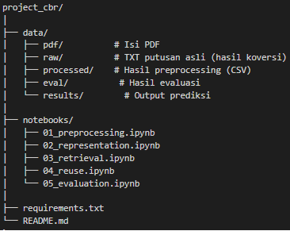

# Case-Based Reasoning (CBR) System untuk Analisis Putusan Pengujian Undang-Undang dan Perselisihan Hasil Pemilu (PUU–PHPU) dari Mahkamah Konstitusi (MK)

Sistem **Case-Based Reasoning (CBR)** untuk menganalisis dan memprediksi putusan perkara hukum pada domain **sengketa pertanahan**.

## Deskripsi Proyek

Sistem bekerja dengan tahapan lengkap CBR:

1. **Case Base Construction** – pengumpulan data putusan
2. **Case Representation** – ekstraksi & struktur data
3. **Case Retrieval** – TF-IDF + cosine similarity
4. **Case Reuse** – pengambilan solusi dari kasus mirip
5. **Evaluation** – pengukuran performa model

## 📂 Struktur Project


## ⚙️ Instalasi Project

### 1. Clone Repository

\```bash
git clone https://github.com/USERNAME/project_cbr.git
cd project_cbr
\```

### 2. Buat Virtual Environment

**Windows**
\```bash
python -m venv venv
venv\Scripts\activate
\```

**Mac/Linux**
\```bash
python3 -m venv venv
source venv/bin/activate
\```

### 3. Install Dependencies

\```bash
pip install -r requirements.txt
\```

Isi `requirements.txt`:


pandas `pip install pandas`

numpy `pip install numpy`

scikit-learn `pip install scikit-learn`

pdfminer.six `pip install pdfminer.six`

beautifulsoup4 `pip install beautifulsoup4`

requests `pip install requests`

tqdm `pip install tqdm`

matplotlib `pip install matplotlib`

## Langkah-Langkah Pengerjaan

### Tahap 1 – Case Base Construction

1. Menentukan domain pengerjaan (PUU dan MHPU).
2. Mengambil minimal 30 data putusan dari sumbernya terserah untuk sumbernya (Mahkamah Konstitusi).
3. Menyimpan seluruh putusan dalam bentuk PDF di `data/pdf/` (penamaan file bebas).
4. Mengonversi PDF menjadi teks menggunakan `pdfminer.six` (lihat `01_preprocessing.ipynb` cell 3 untuk cara konversi).
5. Menyimpan hasil konversi di `data/raw/`, lalu membersihkan dan menyimpannya ulang.

### Tahap 2 – Case Representation

6. Memuat (load) teks hasil tahap 1 dan mengubahnya menjadi dataset terstruktur.
7. Membersihkan data hasil load, lalu menyimpannya kembali.
8. Hasil akhir disimpan di `data/processed/cases.csv`.

### Tahap 3 – Case Retrieval

9. Memuat dataset hasil tahap 2.
10. Membuat representasi TF-IDF vector dari dataset.
11. Menjalankan retrieve function untuk pengujian (opsional).

### Tahap 4 – Case Reuse

12. Menambahkan kolom `amar_putusan` (jika belum tersedia).
13. Melakukan mapping, prediksi, dan pengujian berdasarkan kolom `amar_putusan`.

### Tahap 5 – Evaluation

14. Menyiapkan data uji.
15. Melakukan evaluasi retrieval terhadap data uji.
16. Mengecek metrik dan menyimpan hasil evaluasi ke:
    - `data/eval/prediction_metrics.csv`
    - `data/eval/retrieval_metrics.csv`